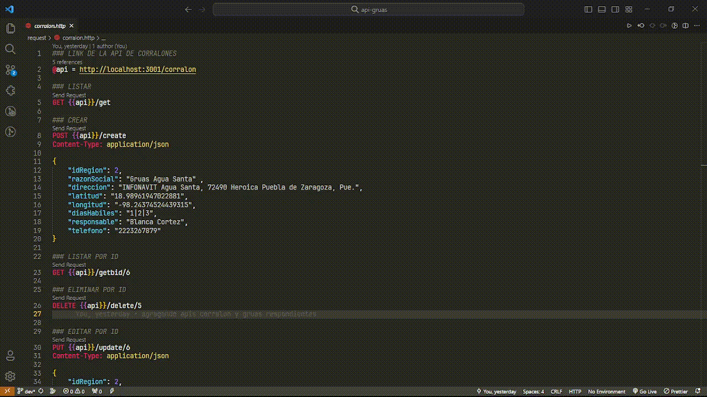

# API'S ASIGNACION DE GRUPOS Y SALONES

Backend creado en su totalidad con EXPRESS JS para uso de SQLSERVER.

## Carpetas
    
- __Controllers:__  Contiene las funciones que se necesitara para cada entidad de la base de datos.

- __Database:__ Contiene las funciones necesarias para la conexión a la base de datos y los estatus de respuesta a las peticiones.

- __Routes:__ En esta carpet se crean clases donde se creara cada ruta de las apis para los controladores.

## Archivos esenciales

- __app.js:__ Este archivo configura la aplicación Express con ciertos middleware, configura el puerto y utiliza rutas específicas relacionadas con los cada ruta de los controladores.

- __index.js:__ En este archivo instanciamos a app y configuramos el puerto por donde la aplicacion estara echuchando.

- __config.js:__ En este archivo importamos las variables de entorno que necesarias.

- __.babelrc:__ Archivo de configración de babel para la correcta integracion de las dependencias y plugins.

## Comandos a ejecutar

Primero debemos de instalar las dependencias necesarias con:

    $ npm install

Si queremos ejecutar en modo desarrollo ejecutaremos el siguente comando:

    $ npm run dev

## Antes de ejecutar

Tienes que crear en la raiz del proyecto un archivo .env con la siguiente estructura.

    PORT = 3000

    USER = ''
    PASSWORD = 'localhost'
    SERVER = ''
    DATABASE = ''

Los datos del .env deben ser correspondientes a tu SQlServer. 

### Configuración de SQLSERVER

¡Como tip use el SSMS para que todo sea mas fácil!

1. Tienes que restaurar el archivo .bak que se encuntra en la carpeta database donde contiene la base de datos para ello puedes consultar la documentación oficial: [Restaurar una base de datos con archivos .bak][3]

[3]: https://learn.microsoft.com/es-es/sql/relational-databases/backup-restore/restore-a-database-backup-using-ssms?view=sql-server-ver16#examples

2. Para crear un usuario en SQLSever con los permisos de SYSADMIN puedes revisar la documentación oficial: [Agregar usuario en SQLSERVER][1]

[1]: https://learn.microsoft.com/en-us/sql/relational-databases/security/authentication-access/create-a-login?view=sql-server-ver16

3. Debes de activar la comunicacion TCP/IP para eso puedes revisar la documentación oficial: [Activar TCP/IP][2]

[2]: https://learn.microsoft.com/es-es/sql/database-engine/configure-windows/configure-a-server-to-listen-on-a-specific-tcp-port?view=sql-server-ver16

## Ejemplos de uso de las rutas

Las rutas de las apis se encuentran dentro de la carpeta request donde cada modelo tiene sus rutas especificas y el uso de la mismas.
Para poder ocuparlas con los archivos .http use la extención REST Client.

